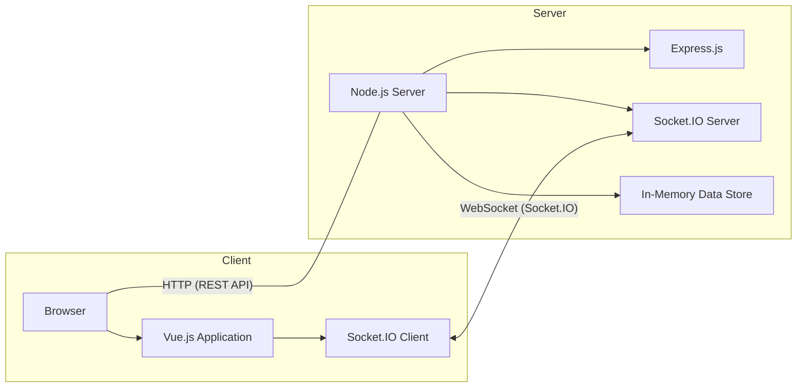

# Accessible Tic-Tac-Toe Web Application

## Overview

This project is an **Accessible Tic-Tac-Toe** game built with **Vue.js** for the frontend and **Node.js** with **Socket.IO** for the backend. The application is designed to be inclusive, ensuring that users with sensory impairments, particularly those relying on screen readers like **NVDA**, can seamlessly interact with the game. It supports real-time multiplayer functionality, allowing two players to engage in a game simultaneously with live updates.

## Features

- **Create and Join Game Sessions:** Users can create new game sessions or join existing ones using unique Game IDs.
- **Real-Time Multiplayer:** Two players can play against each other in real-time with instant updates on moves.
- **Past Moves History:** View a chronological list of all moves made during the game.
- **Accessibility:** Designed with accessibility in mind, including ARIA attributes, keyboard navigation support, and optimized screen reader announcements.
- **Error Handling:** Informative alerts guide users when attempting invalid actions, such as joining a full game or making a move out of turn.


## Assumptions and Architectural Decisions

### Assumptions

1. **Two-Player Limitation:** Each game session is limited to two players (Player X and Player O). Additional users attempting to join a full game will receive an error message and be redirected to the game selection screen.
2. **In-Memory Storage:** Game sessions and their states are stored in memory for simplicity. This approach is suitable for a prototype but not recommended for production environments.
3. **Local Development Environment:** The application is intended to be run locally on a developer's machine without the need for deployment to external servers.

### Architectural Decisions

1. **Framework Choice:**
    - **Frontend:** **Vue.js** was chosen for its simplicity, reactivity, and ease of integration with other libraries.
    - **Backend:** **Node.js** with **Express** and **Socket.IO** was selected for its lightweight nature and robust real-time communication capabilities.

2. **Real-Time Communication:** **Socket.IO** facilitates real-time, bidirectional communication between the client and server, enabling instant updates of game states across connected clients.

3. **Accessibility Focus:** Emphasis was placed on making the application accessible by utilizing semantic HTML structures, ARIA attributes, and ensuring compatibility with screen readers like **NVDA**.

4. **Keyboard Navigation:**
   - **Tab and Enter Keys:** The game is fully navigable using the **Tab** key to move through interactive elements and the **Enter** key to activate them. This allows users who rely on keyboards to interact with the game without needing a mouse.
     - **Implementation Details:**
       - **Focus Management:** Logical tab order ensures that users can navigate through the game board, create/join game sessions, and other interactive controls sequentially.
       - **Activating Cells:** Each game cell is focusable and can be activated using the **Enter** key, enabling users to make moves efficiently.
       - **Visual Indicators:** Focus states are clearly visible, providing visual cues to users about which element is currently active.

### Architecture Diagram



## Installation

### Prerequisites

- **Node.js and npm:** Ensure that Node.js (which includes npm) is installed on your machine. You can download it from [https://nodejs.org/](https://nodejs.org/). For compatibility, please use Node.js version 18.18.0.

### Clone the Repository

```
git clone https://github.com/shogun187/tic-tac-toe-client.git
cd tic-tac-toe-client
```

### Frontend Setup

1. Inside tic-tac-toe client, run ```npm install``` to install the required npm packages
2. To launch the frontend application, run ```npm run serve```

### Backend Setup

1. Run ```cd server``` and ensure that you are in the server directory
2. Run ```npm install``` to install the required npm packages
3. To launch the backend server, run ```node server.js```

### Playing The Game

1. Open a web browser and navigate to ```http://localhost:8080```.
2. On the main page, click the "Create New Game" button and remember the Game ID created.
3. On another browser, navigate to the same page and enter the Game ID in the input box and join the game.

## API Documentation

This section outlines the backend API endpoints and Socket.IO events, providing specifications and sample requests to interact with the application.

### REST API Endpoints

#### 1. Create a New Game

- **Endpoint:** `/api/games`
- **Method:** `POST`
- **Description:** Creates a new Tic-Tac-Toe game session.

##### Request

- **Headers:**
  - `Content-Type: application/json`
- **Body:** None

##### Response

- **Body:**
  ```json
  {
    "id": "1",
    "board": [null, null, null, null, null, null, null, null, null],
    "currentPlayer": "X",
    "winner": null,
    "moves": []
  }
  ```

#### 2. Get Existing Game

- **Endpoint:** `/api/games/:id`
- **Method:** `GET`
- **Description:** Retrieves the details of an existing Tic-Tac-Toe game session by Game ID.

##### Request

- **Headers:**
  - `Content-Type: application/json`
- **Body:** None

##### Response

- **Body:**
  ```json
  {
    "id": "1",
    "board": ["X", null, "O", null, "X", null, null, null, null],
    "currentPlayer": "O",
    "winner": null,
    "moves": [
      { "player": "X", "index": 0 },
      { "player": "O", "index": 2 },
      { "player": "X", "index": 4 }
    ]
  }
  ```
  
### Socket.IO Events 
The application uses Socket.IO for real-time communication between the client and server. Below are the primary events used in the application.
  
#### Client-to-Server Events

#### 1. `joinGame`

**Description:**  
Allows a user to join a specific game session.

**Payload:**

```json
{
  "gameId": "1"
}
```

**Usage Example:**

```socket.emit('joinGame', '1')```

#### 2. `makeMove`

**Description:**  
Sends a move action from the player to the server.

**Payload:**

```json
{
  "gameId": "1",
  "index": 4,
  "player": "X"
}
```

**Usage Example:**

```socket.emit('makeMove', { gameId: '1', index: 4, player: 'X' });```


